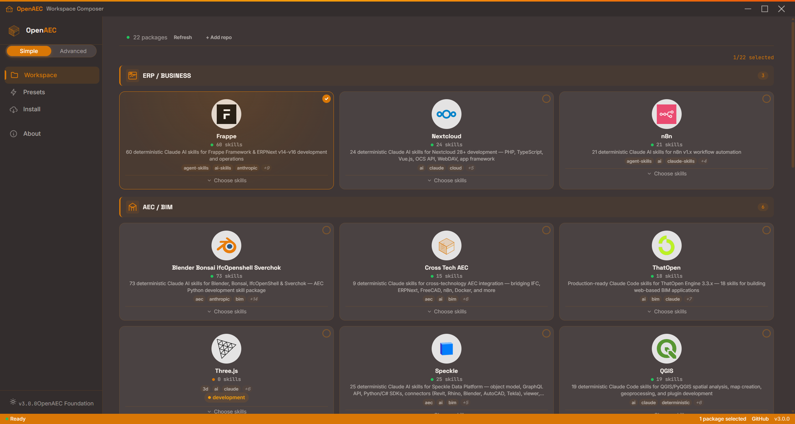
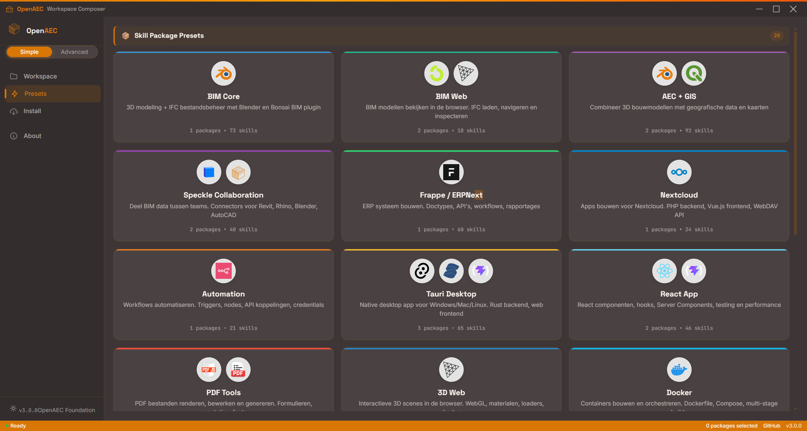
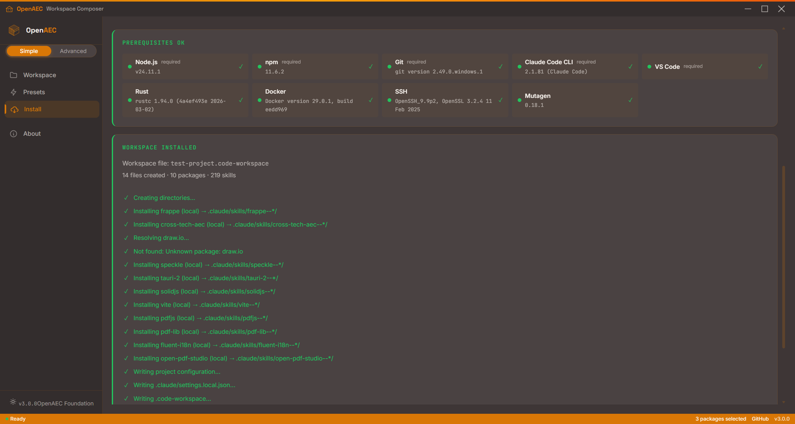

<div align="center">


<br/>


<br/>

<a href="#quick-start"></a>
<a href="#skill-packages"></a>
<a href="#presets"></a>
<a href="https://v2.tauri.app"></a>
<a href="https://www.solidjs.com"></a>
<a href="https://www.rust-lang.org"></a>
<a href="LICENSE"></a>

<br/><br/>

**Stel in seconden een volledig geconfigureerde Claude Code workspace samen met skill packages, CLAUDE.md, permissions, MCP servers, hooks en commands.**

*Build free. Build together.*

</div>

---

## Screenshots

### Workspace: selecteer skill packages met officieel logos


### Presets: combineerbare bundels


### Install: skills geinstalleerd in .claude/skills/


---

## Wat doet het

**Workspace Composer** is een desktop app van de [OpenAEC Foundation](https://github.com/OpenAEC-Foundation) die Claude Code workspaces configureert. Selecteer skill packages, kies een map, en de app installeert alles.

### Wat er geinstalleerd wordt

```
jouw-project/
├── CLAUDE.md                     ← Projectinstructies voor Claude
├── .claude/
│   ├── settings.local.json       ← Permissions en configuratie
│   └── skills/
│       ├── tauri-2--*/           ← Tauri 2 skills (auto-discovered)
│       ├── solidjs--*/           ← SolidJS skills
│       └── vite--*/              ← Vite skills
├── .gitignore                    ← Met PROMPTS.md bescherming
└── jouw-project.code-workspace   ← VS Code workspace
```

Claude Code ontdekt de skills automatisch uit `.claude/skills/`. Je hoeft niks extra te configureren.

### De CLAUDE.md die gegenereerd wordt

```markdown
# Mijn Project

## What to build
Describe your project here. Claude will use this context...

## Available Stack
- Tauri 2
- SolidJS
- Vite

Claude automatically loads the relevant skills based on what you're working on.

## How to work
- Tell Claude what you want to build. Be specific about functionality.
- Claude knows your stack. Ask it to use the installed technologies.
- Start simple. Get something working first, then iterate.
```

---

## Skill Packages

22 packages, 440+ skills. Live registry van GitHub.

### AEC/BIM

| Package | Skills | Status |
|---------|--------|--------|
| **Blender Bonsai IfcOpenShell Sverchok** | 73 |  |
| **ThatOpen Engine** | 18 |  |
| **Speckle** | 25 |  |
| **QGIS** | 19 |  |
| **Three.js** | 24 |  |
| **Cross-Tech AEC** | 15 |  |

### ERP/Business

| Package | Skills | Status |
|---------|--------|--------|
| **Frappe/ERPNext** | 60 |  |
| **Nextcloud** | 24 |  |
| **n8n** | 21 |  |

### Web/Desktop

| Package | Skills | Status |
|---------|--------|--------|
| **Tauri 2** | 27 |  |
| **React** | 24 |  |
| **SolidJS** | 16 |  |
| **Vite** | 22 |  |
| **PDF.js** | 15 |  |
| **pdf-lib** | 17 |  |
| **Fluent i18n** | 16 |  |
| **Open PDF Studio** | 6 |  |

### DevOps

| Package | Skills | Status |
|---------|--------|--------|
| **Docker** | 22 |  |
| **Draw.io** | 22 |  |

Je kunt ook eigen GitHub repo's toevoegen via "+ Add repo" in de app.

---

## Presets

Core presets die je combineert. Elke preset bevat 1-3 packages.

| Preset | Packages | Geschikt voor |
|--------|----------|---------------|
| **BIM Core** | Blender Bonsai | 3D modeling, IFC bestanden |
| **BIM Web** | ThatOpen, Three.js | BIM viewer in de browser |
| **AEC + GIS** | Blender Bonsai, QGIS | BIM met geografische data |
| **Frappe/ERPNext** | Frappe | ERP systeem bouwen |
| **Nextcloud** | Nextcloud | Cloud app development |
| **Automation** | n8n | Workflow automatisering |
| **Tauri Desktop** | Tauri 2, SolidJS | Native desktop app |
| **React App** | React, Vite | React frontend |
| **Docker** | Docker | Containerization |
| ... en meer | | Selecteer meerdere presets om ze te combineren |

---

## Modes

### Simple (standaard)
Drie stappen: **Workspace** (selecteer packages), **Presets** (one-click bundels), **Install** (kies map, installeer).

### Advanced (alpha)
> ⚠️ Advanced mode is in alpha. Features werken maar zijn niet uitgebreid getest.

Extra pagina's voor fijnafstelling: Settings, Permissions, Hooks, MCP Servers, Commands, Memory, Templates, CORE Files, Prompts, GPU Server, Authentication, Git.

---

## Quick Start

### Vereisten

- [Node.js](https://nodejs.org/) 20+
- [Rust toolchain](https://rustup.rs/)
- [Git](https://git-scm.com/)

### Installatie

```bash
git clone https://github.com/OpenAEC-Foundation/OpenAEC-Workspace-Composer.git
cd OpenAEC-Workspace-Composer
npm install
npm run tauri dev
```

### Gebruik

1. Open de app
2. Selecteer packages (of kies een preset)
3. Ga naar **Install**
4. Kies een map en geef je project een naam
5. Klik **Install Workspace**
6. Open de gegenereerde workspace in VS Code

---

## Stack

| Layer | Technologie |
|-------|-------------|
| **Frontend** | SolidJS, TypeScript, Vite 8, Solid Router |
| **Backend** | Rust, Tauri 2 |
| **Icons** | Tabler Icons (solid-icons/tb) |
| **CSS** | 30 modulaire CSS bestanden, Construction Amber palette |
| **Registry** | Live GitHub API fetch (OpenAEC-Foundation + Anthropic skills) |

---

## Bijdragen

Bijdragen zijn welkom. Nieuwe skill packages, presets, bugfixes of documentatie.

1. Fork het project
2. Maak een feature branch (`git checkout -b feat/mijn-feature`)
3. Commit met [Conventional Commits](https://www.conventionalcommits.org/)
4. Open een Pull Request

---

## Licentie

MIT &copy; [OpenAEC Foundation](https://github.com/OpenAEC-Foundation)

<div align="center">

<br/>

[](https://github.com/OpenAEC-Foundation)
[](https://github.com/OpenAEC-Foundation/OpenAEC-style-book)
[](https://github.com/OpenAEC-Foundation/open-agents)

*Build free. Build together.*

</div>


